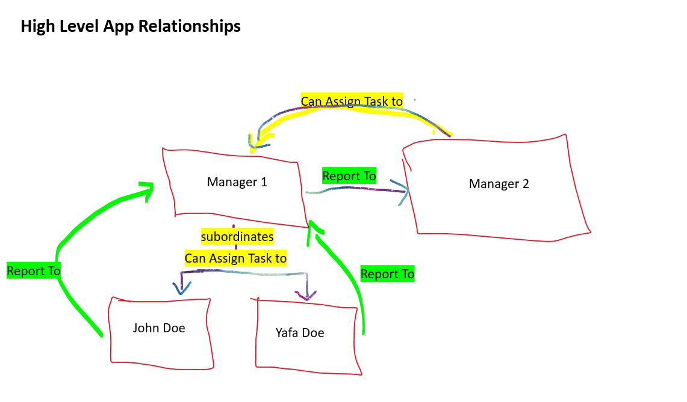
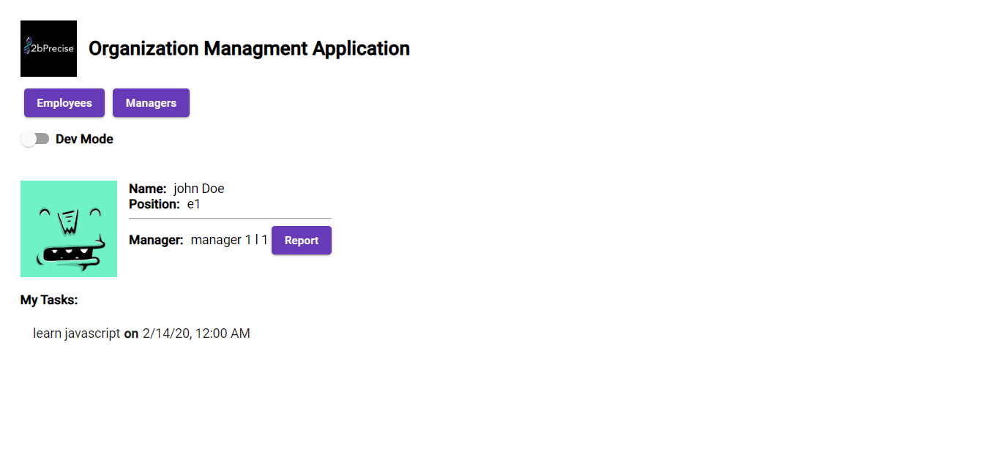
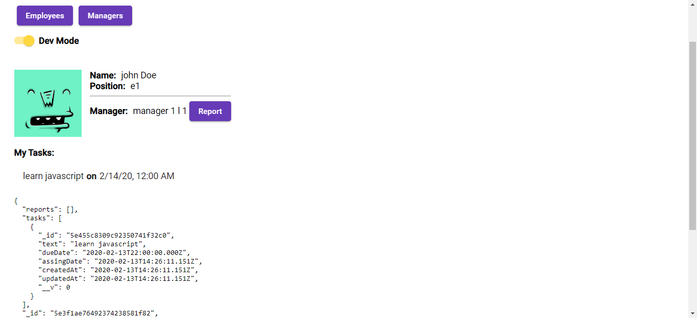
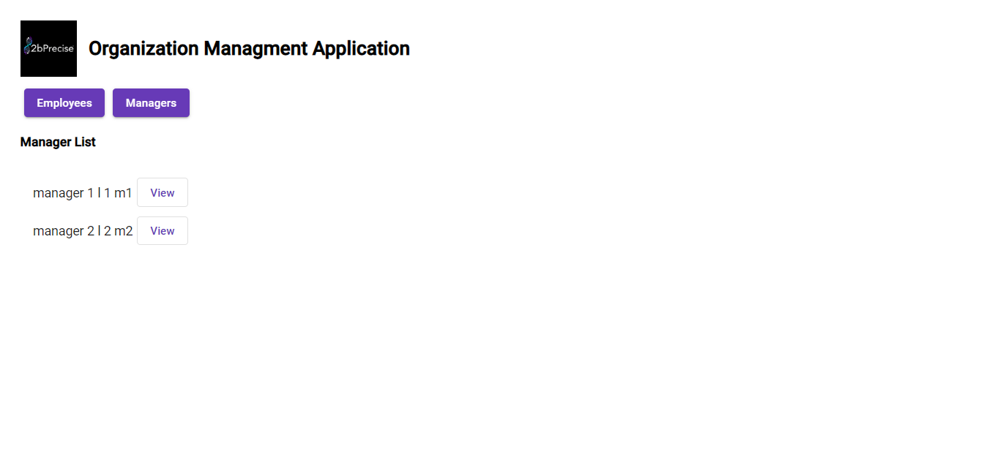
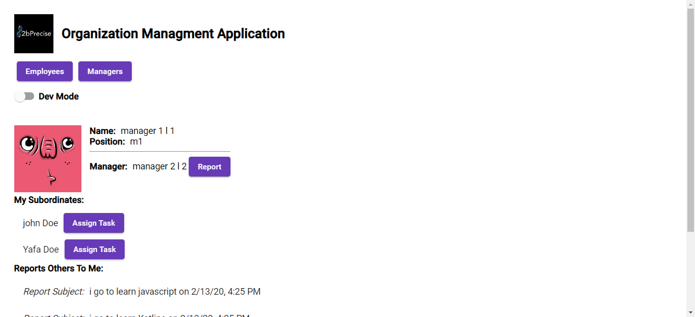
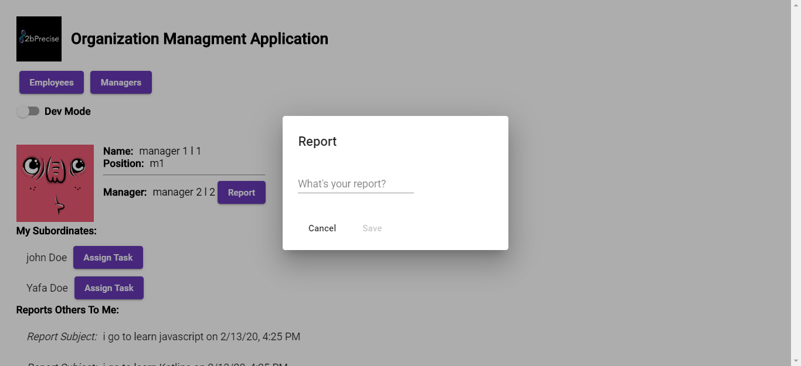
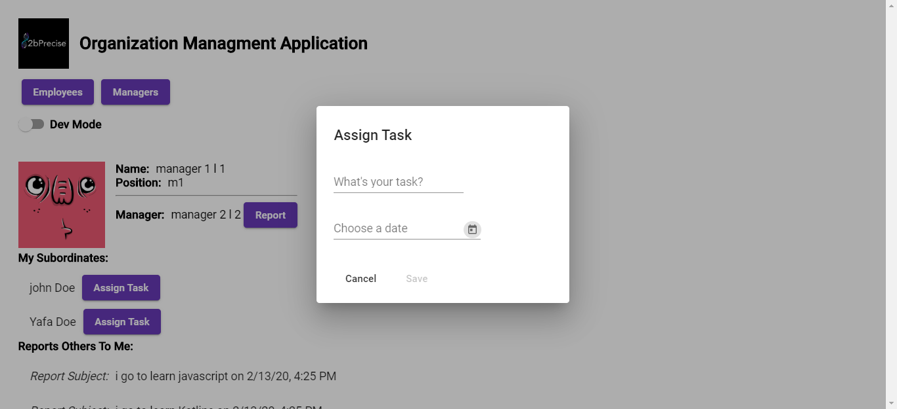
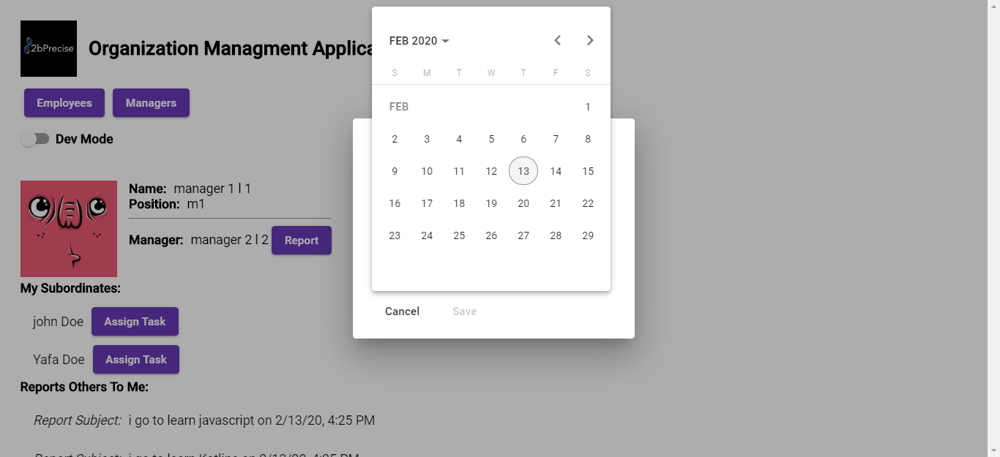
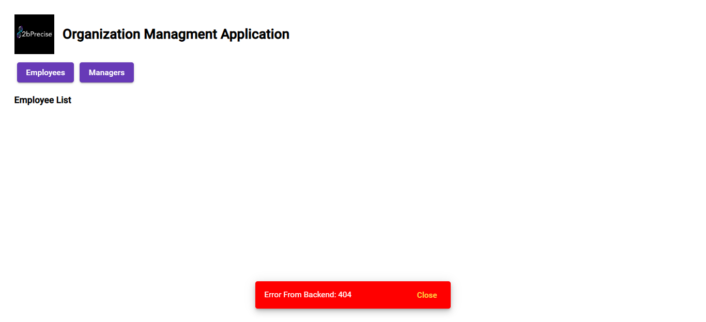

### Exercise

#### Showcase

#### High Level App Relationship Diagram

The app is seperate into two parts:
- server - NestJS with mongoose (NodeJS)
- client - Angular 9 :)

### App Problem And Solution
App Purpose: An app that represent organization structure

Domains/Models of apps:
- Employee
- Manager
- Report
- Task

- Server Side: Create a NestJS (use the mongoose adapter). REST APIs controllers created to handle the CRUD operations of this application.
- Client Side: Create an web app application, based on angular that represent the organiztion structure

Tools Use:
1. Server
- mongoose
- NestJs
- Mongo Compass (To Push Manually Data)
- Postman

2. Client
- Angular 9
- Angular Material
- Regular classes for services
- Component composition

# Design:
## Client:
1. Modules By Features
2. Use Shared Components
3. Use Smart And Dumb Components
4. Use Regular Service for get Data from server
5. use local component state managment
 
## Server:
1. Nest JS - Controller, Services, Schemas, Dto and interfaces
2. DB Schemas: Employees, Managers, Reports, Tasks
- all is wired with "forign key" (id)
3. Data retrive by aggregate information from several schemas

## Screen Shots

### Rights Reserved
All Rights Reserved, @2020, Chen Reuven